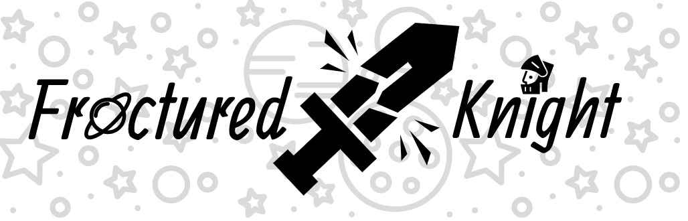

# Introduction
Fractured Knight is a medieval-space themed adventure game that incorporates text-based interaction and has 
a combat system that takes heavy influence from Pokémon!

## Features 
* Text-Based Interaction System
* Text-Based Combat System
* Dynamic Storyline Progression w/ Multiple Endings
* Inventory System(?)
* Many Planets to Explore!

## Technology 
Our technology stack can be separated into two divisions: tools and frameworks which are utilised to develop the game itself and those that are used to produce our development blog.

[Godot](https://godotengine.org/) - Godot is an open source game engine written in C++ with an engine defined language known as GDScript (Python-esque)   
[NodeJS](https://nodejs.org/en/) - Server side scripting language that will handle connections to our website and serve dynamic content  
[Express](https://expressjs.com/) - Lightweight framework for producing dynamic web pages on the server side using NodeJS  
[MongoDB](https://www.mongodb.com/) - Database Management System that stores and serves all data as JSON objects  

## Authors 
Khanh Duong ([@Jastolfo](https://github.com/Jastolfo))  
Mohammed Hussain ([@hussam47](https://github.com/hussam47))  
Vikram Kainth ([@vsskkv](https://github.com/vsskkv))  
Nathan Lewis ([@NathanALewis](https://github.com/NathanALewis))  
Rajan Malhi ([@malhir2](https://github.com/malhir2))  
Jamie Massey ([@jamiealanmassey](https://github.com/jamiealanmassey))  
Karandeep Saini ([@karansaini302](https://github.com/karansaini302))  

## Appendix 
* __TODO: Add a link to the website repository__
